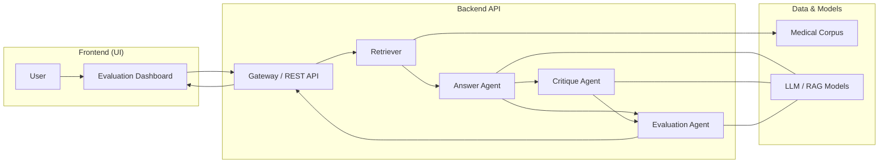

# MedRAG Multi‑Agent Evaluation

A multi‑agent Retrieval‑Augmented Generation (RAG) framework for evaluating medical QA systems with answer, critique, and evaluation agents.  
This project provides an end‑to‑end pipeline from question submission to automatic scoring of LLM‑based medical assistants.

## Features

- Multi‑agent architecture with **Answer**, **Critique**, and **Evaluation** agents for medical QA.
- Pluggable RAG stack: swap retrievers, vector stores, and LLM backends without changing the evaluation logic.
- Evaluation metrics for faithfulness, relevance, completeness, and safety, optimized for medical use‑cases.
- Dashboard for visualizing per‑question traces (retrieval → answer → critique → scores).

## System Architecture

The system follows a client–server design with a dedicated data & models layer.



### Components

- **Frontend (UI)**  
  Evaluation dashboard for entering medical questions and inspecting retrieved evidence, answers, critiques, and metrics. Can be implemented in Streamlit, Gradio, or any SPA calling the REST API.

- **Gateway / REST API**  
  Single entrypoint (e.g., FastAPI) exposing `/ask`, `/evaluate`, and `/batch_evaluate` endpoints. Orchestrates calls between retriever, agents, and evaluation logic.

- **Retriever**  
  Embedding‑based or BM25 retrieval over a curated medical corpus (guidelines, PubMed abstracts, MedRAG/MIRAGE datasets). Returns the top‑k passages used by the answer and critique agents.

- **Answer Agent**  
  LLM‑powered agent that generates grounded answers using retrieved context. Supports multiple backends (OpenAI, local models, MedRAG pipelines) via a common interface.

- **Critique Agent**  
  Secondary LLM agent that reviews the answer (and context) for hallucinations, missing evidence, unsafe advice, and guideline violations. Produces structured feedback used by the evaluation agent and shown in the UI.

- **Evaluation Agent**  
  Converts outputs into structured metrics: faithfulness, relevance, completeness, harmfulness, and overall score. Designed to support rubric‑based and LLM‑as‑a‑judge evaluation strategies.

- **Data & Models**  
  - *Medical Corpus*: versioned datasets and knowledge bases optimized for medical QA.  
  - *LLM / RAG Models*: one or more models wrapped behind a common interface so agents can switch models for A/B experiments.

## Quick Start

1. **Clone the repository**

   ```bash
   git clone https://github.com/<your-org>/medrag_multiagent_evaluation.git
   cd medrag_multiagent_evaluation
   ```

2. **Install dependencies**

   ```bash
   pip install -r requirements.txt
   ```

3. **Configure models and data**

   - Set your LLM and embedding keys in `.env` (e.g., `OPENAI_API_KEY`, `ANTHROPIC_API_KEY`).
   - Point `config/corpus.yaml` to your medical corpus or MedRAG‑style datasets.

4. **Run the backend**

   ```bash
   uvicorn app.main:app --reload
   ```

5. **Launch the dashboard**

   ```bash
   streamlit run ui/app.py
   ```

   The dashboard will connect to the backend API and render the full multi‑agent trace for each query.

## Evaluation Workflow

- **Single question mode**  
  User submits a question from the UI. The system runs retrieval → answer agent → critique agent → evaluation agent. The UI displays answer, evidence, critique text, and metric scores for manual inspection.

- **Batch evaluation mode**  
  Run a CLI over a dataset of medical QA pairs. Metrics are stored in `results/*.jsonl` and aggregated into summary tables and plots.

## Roadmap

- Add support for more medical benchmarks and evaluation rubrics.  
- Integrate external evaluators (e.g., DeepEval / Vertex AI eval) as alternative backends for the evaluation agent.  
- Provide ready‑to‑use configs for popular multi‑agent frameworks (LangGraph, AutoGen, CrewAI, Swarm).
