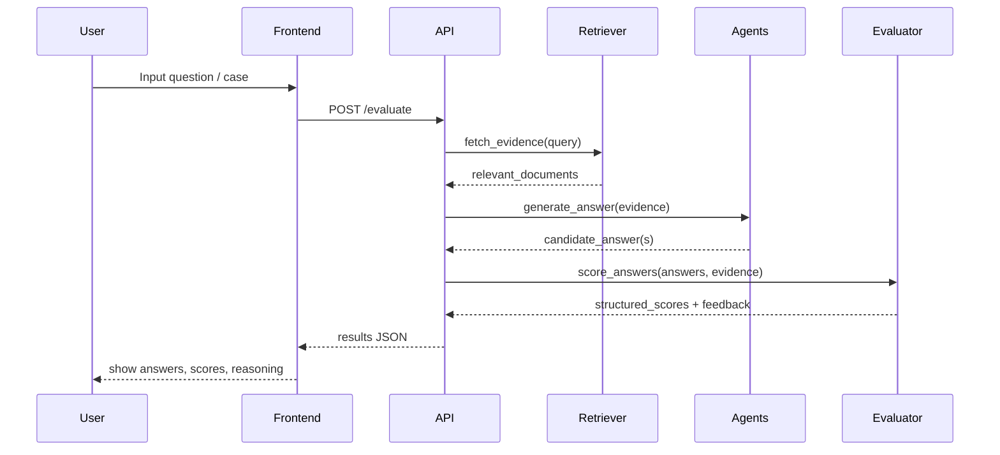

# MedRAG Multi‑Agent Evaluation

> A multi‑agent Retrieval‑Augmented Generation (RAG) evaluation framework for medical question answering and clinical reasoning.

---

## 🔍 Overview

MedRAG Multi‑Agent Evaluation is a **full‑stack** application (frontend + backend) that orchestrates multiple LLM‑based agents to evaluate responses for medical tasks such as diagnosis support, summarization, and knowledge QA.  
It is designed to be easily deployable (e.g. via Render) and extensible for new tasks and models.

---

## ✨ Key Features

- Multi‑agent evaluation pipeline for medical RAG.
- Modular **backend** for agents, tools, and scoring.
- Interactive **frontend** for running and visualizing evaluations.
- Config‑driven deployment (via `render.yaml`).
- Easily extendable to new datasets and model providers.

---

## 🧠 Conceptual Flyover

The idea of this project:

1. A user or benchmark provides a clinical question or case.
2. A retrieval module fetches relevant medical evidence (guidelines, literature, notes).
3. One or more LLM agents generate and critique responses.
4. An evaluation agent scores responses on dimensions like correctness, safety, and reasoning quality.
5. The frontend visualizes results and comparisons.

You can think of it as a “panel of AI clinicians” that both answer and **evaluate**.

---

## 📊 System Architecture (Infograph‑Style)

```mermaid
flowchart LR
    subgraph Client[Frontend (UI)]
        U[User]
        UI[Evaluation Dashboard]
    end

    subgraph Server[Backend API]
        G[Gateway / REST API]
        R[Retriever]
        A1[Answer Agent]
        A2[Critique Agent]
        E[Evaluation Agent]
    end

    subgraph Data[Data & Models]
        D[(Medical Corpus)]
        M[(LLM / RAG Models)]
    end

    U --> UI
    UI --> G

    G --> R
    R --> D

    R --> A1
    A1 --> A2
    A1 --> E
    A2 --> E

    G <-- E
    UI <-- G

    A1 --- M
    A2 --- M
    E --- M
```

---

## 🔁 Evaluation Flow Chart



---

## 🧩 Repository Structure

```text
medrag_multiagent_evaluation/
├── backend/           # Backend application (APIs, agents, retrieval, evaluation)
├── frontend/          # Frontend UI (dashboard, visualizations)
├── .gitignore         # Git ignores for the project
├── render.yaml        # Render deployment config
├── requirements.txt   # Python dependencies for backend / services
└── runtime.txt        # Runtime / Python version hints for hosting
```

---

## 🚀 Getting Started

### 1. Clone the repository

```bash
git clone https://github.com/rika1089/medrag_multiagent_evaluation.git
cd medrag_multiagent_evaluation
```

### 2. Backend setup

```bash
cd backend
python -m venv .venv
source .venv/bin/activate   # On Windows: .venv\Scripts\activate
pip install -r ../requirements.txt
```

Then run the backend (adjust if you use FastAPI, Flask, etc.):

```bash
# Example (replace with your actual command)
uvicorn app.main:app --host 0.0.0.0 --port 8000 --reload
```

### 3. Frontend setup

```bash
cd ../frontend
# Example for React/Vite – update to your stack
npm install
npm run dev
```

Open the URL printed by your dev server (for example `http://localhost:5173`) to access the UI.

---

## ☁️ Deployment (Render / similar)

This repository includes a `render.yaml` which describes how to deploy the backend (and optionally the frontend) as web services.

Typical flow:

1. Push your code to GitHub.
2. Connect the repo to Render.
3. Render reads `render.yaml` and creates services.
4. Configure environment variables (API keys, model endpoints, etc.).
5. Trigger a deploy.

Once deployed, update the frontend to use the deployed backend URL.

---

## 🧪 How to Run an Evaluation

A typical evaluation run:

1. Open the frontend dashboard.
2. Choose:
   - Model(s) or agent configuration.
   - Dataset or single custom query.
3. Start the run and monitor progress.
4. Review:
   - Answer text.
   - Evidence snippets used.
   - Scores for correctness, safety, and reasoning.
   - Explanations from evaluation agents.
5. Export results (CSV/JSON) if supported by the UI.

---

## 🧱 Extending the Framework

You can extend the project in several directions:

- Add new agent roles (e.g., **safety reviewer**, **simplifier**, **guideline checker**).
- Plug in alternative retrievers or vector databases.
- Register additional evaluation metrics (calibration, hallucination rate, etc.).
- Integrate new LLM providers via API adapters.

A common pattern is to implement a new agent class in the backend and then expose a configuration option in the frontend.

---

## 🎨 “Moving Text” & Visual Enhancements

GitHub does not support arbitrary CSS animations in `README.md`, but you can still make it attractive:

- Use badges:

  ```markdown
  
  
  ```

- Use animated GIFs for demos:

  ```markdown
  ## Live Demo Preview

  *Coming soon: short GIF demo of the evaluation dashboard in action.*

  <!-- When ready, replace with an actual GIF stored in the repo:
  
  -->
  ```

- Use collapsible sections:

  ```markdown
  <details>
  <summary>Click to expand advanced configuration</summary>

  - Custom prompt templates
  - Model routing strategies
  - Fine‑grained scoring rubrics

  </details>
  ```

These tricks create a sense of “motion” and interactivity without custom CSS.

---

## 🧾 Requirements

See [`requirements.txt`](./requirements.txt) and [`runtime.txt`](./runtime.txt) for the exact Python packages and runtime used.  
Front‑end dependencies are managed via the package manager used under `frontend/` (for example, `npm` or `yarn`).

---

## 🛡️ Disclaimer

This project is for **research and evaluation** purposes in the medical domain.  
It is **not** a substitute for professional medical advice, diagnosis, or treatment.  
Outputs must always be reviewed and validated by qualified clinicians before use in any real‑world setting.

---

## 📜 License

Add your chosen license here (for example MIT, Apache‑2.0, etc.).

```text
Example:
This project is licensed under the MIT License – see the LICENSE file for details.
```

---

## 👤 Author

- **Rika** – [@rika1089](https://github.com/rika1089)

Contributions, suggestions, and issue reports are welcome!
